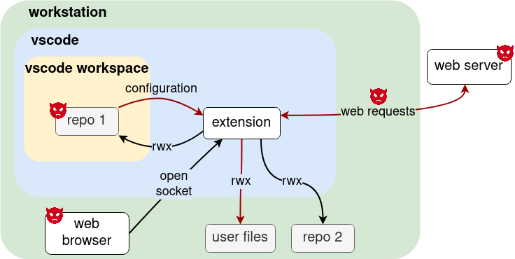
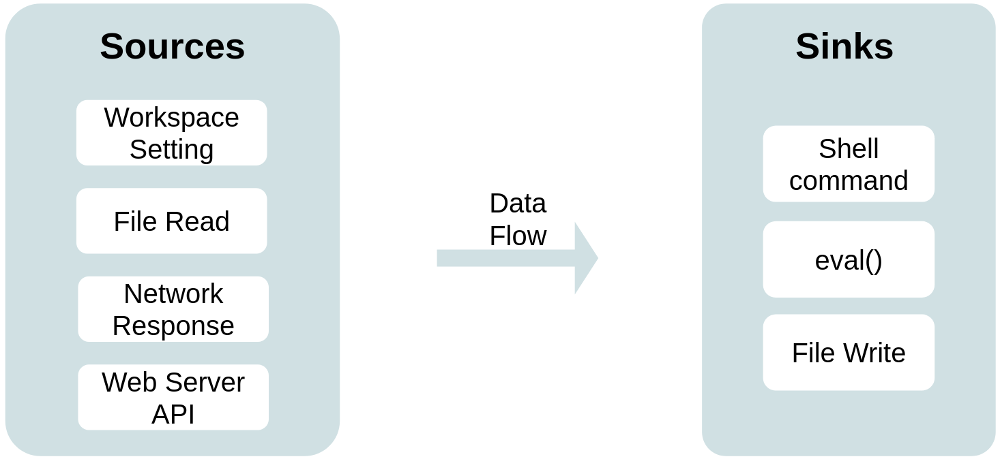
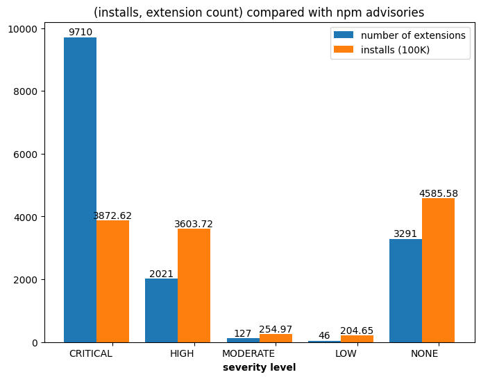

# UntrustIDE: Weaknesses in VS Code Extensions

*TLDR: We found vulnerabilities in VS Code extensions and verified code execution exploits impacting more than 6 million installations. We also found that more than a fifth of the extensions import dependencies with a critical-level security advisory.*

---

Most likely you've heard of Visual Studio Code or VS Code.
It's the most popular integrated development environment (IDE), used by 73% developers, according to the [2023 Stack Overflow Developer Survey](https://survey.stackoverflow.co/2023/#section-most-popular-technologies-integrated-development-environment).

VS Code's popularity can be attributed to its extension ecosystem.
There are more than 50 thousand extensions on their [marketplace](https://marketplace.visualstudio.com/vscode). 
Anyone is able to develop and publish an extension on to the marketplace.

Given that, would there be vulnerabilities in extensions?
A vulnerability in these extensions would directly developers as they have access to files, network, shell, etc on the installed workstation.

This is what our study set out to explore: **What are the vulnerabilities in VS Code extensions?**

## Analysis of the VS Code Extension Ecosystem

To identify potential vulnerabilities in the ecosystem, we first came up with a threat model specific to VS Code extensions.

We assume the following:
- Extension users are benign, but they could download untrusted (potentially malicious) data
- Extension developers are benign
- The goal of an external attacker is code execution on the VS Code user's workstation

*\*Note, we only consider vulnerable extensions and don't consider malicious extensions.*

<figure>
  
  <figcaption>Threat model of VS Code extensions.</figcaption>
</figure>


As seen in our threat model figure, an attacker can inject malicious values through untrusted sources such as:
- downloaded code repositories
- network traffic
- web servers

These malicious values would find its way through the extension and might end up at a sink where code execution could happen.
So, based on our threat model, we conducted data flow analysis to identify potentially dangerous data flows.
We identified four taint sources and three taint sinks from our threat model and tried to find the 12 combination data flows.

<figure>
  
  <figcaption>Taint sources and taint sinks for data flow analysis.</figcaption>
</figure>

Our data flow analysis is built on [CodeQL](https://codeql.github.com/), a static analysis tool that supports multiple languages.
CodeQL allows construction of queries to find certain data flows or code patterns.

We built 12 base CodeQL data flow queries. 
Some additional *filter queries* were required to refine the data flow results, but I won't go into detail (you can read about it in the [paper](https://www.ndss-symposium.org/ndss-paper/untrustide-exploiting-weaknesses-in-vs-code-extensions/)).
Our custom queries can be found [here](https://github.com/s3c2/UntrustIDE/).

## Findings

So, what did we find from the data flow analysis?

We found a total of **716** dangerous data flows. 

To verify whether these could actually result in a code execution attack by an external attacker, we sampled some extensions and tried to come up with proof-of-concept exploits.

We came up with a total of **21** verified proof-of-concept exploits, which impact more than **6 million** installations.

Let's look at an example exploit we came up with to give you a better idea of how the code execution exploits work.

Say you have
1. The *git-graph* extension installed in VS Code
2. A workspace setting file with value `{"git": { "path": "a-shell-script.sh"}` open in VS Code

This workspace setting value would flow from taint source
```
  const configValue = vscode.workspace.getConfiguration('git').get('path', null);
```
to taint sink
```
  resolveSpawnOutput(cp.spawn(path, ['--version'])).then((values) => { ... }
```

How is this a vulnerability?

The sink `cp.spawn` executes the `path` value, which is the script from `git.path`.
This results in the extension spawning a shell and executing the script `a-shell-script.sh`.
All this happens **without additional action** from the VS Code user or attacker.

What does this mean for a malicious actor or users of VS Code?

The attacker can target and distribute malicious code repositories to *git-graph* extension users and launch a code execution attack.

---

What about vulnerabilities in the extension ecosystem's software supply chain?

VS Code extensions can also import dependencies, given that they are very similar to node.js application.
We did some analysis on the dependencies and found that 9,710 out of 43,436 extensions import npm packages with critical-level advisories. This also brings the software supply chain security concern into this ecosystem.

<figure>
  
  <figcaption>Securiy advisories in VS Code extension dependencies.</figcaption>
</figure>

## Takeaway

What does this mean if I use VS Code?

The majority of the dangerous flows we found were from VS Code workspace settings and files in the workspace.
Therefore, our advice is only open trusted files in your VS Code workspace to prevent unintentional code execution happening on your workstation.


---

Details of this study are in our paper [UntrustIDE: Exploiting Vulnerabilities in VS Code Extensions](https://www.ndss-symposium.org/ndss-paper/untrustide-exploiting-weaknesses-in-vs-code-extensions/).

The queries for our data flow analysis can be found at our GitHub repository [s3c2/UntrustIDE](https://github.com/s3c2/UntrustIDE).

