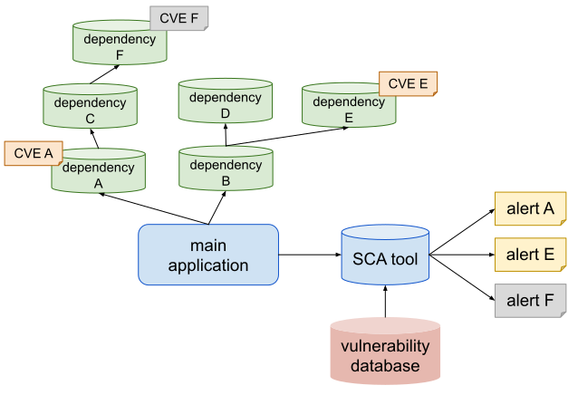
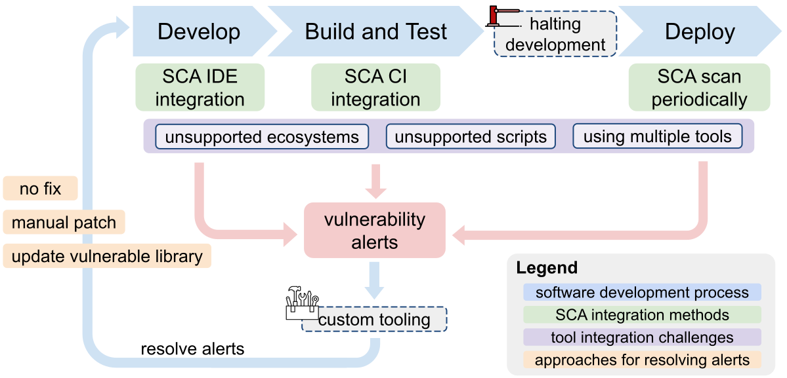

# Context Matters: Qualitative Insights into Developers’ Approaches and Challenges with Software Composition Analysis

*TLDR: We found a lack of context in SCA tool alerts, requiring users to put in additional manual effort for triaging vulnerabilities reported by SCA tools. We believe information related to reachability, infrastructure, network configurations, and exploitability would provide users with useful context.*

---

## What is Software Composition Analysis

Software Composition Analysis or SCA is a process used to identify open-source and third-party components, which can help with identifying vulnerabilities in them.

As the use of third-party components rise, SCA tools have become more prevalent.
However, SCA tools have not kept up with the ever growing number of new vulnerabilities each year.
Developers are flooded with vulnerability alerts and often struggle to quickly remediate critical issues with external components.

<figure>
  
  <figcaption>Representation of SCA tool</figcaption>
</figure>

For example, in the figure above. If CVE E does not affect your application, you would want the SCA tool to not alert you of it. However, most SCA tools alert the user of every vulnerability found in the components. 

As the number of components and vulnerabilities grow, users can be faced with alert fatigue.

## Our approach

Previous studies have looked at how different SCA tools perform compared to each other. 
The studies found that different SCA tools provide varying results.
However, there lacks an understanding of user experience with SCA tools.
- How are SCA tools integrated into the CI/CD pipeline?
- What challenges arise when scaling SCA tools to large organizations?
- How can SCA tools be improved for better vulnerability management?

To address the gaps around integration and encountered challenges, we conducted 20 semi-structured interviews with industry professionals with SCA experience.

We talked to each of them for ~45 minutes, asking questions based on our 4 main research questions:  
**RQ1:** How do users interact with SCA tools?  
**RQ2:** What are the challenges when deploying SCA tools?  
**RQ3:** What are the challenges when acting on SCA results?  
**RQ4:** How can the SCA process be improved?

After talking to our participants, we conducted two-party qualitative coding on the interview transcripts.
We came up with a codebook, essentially a mapping for our findings, based off of our interview questions.
As we analyzed each interview transcript, we assigned codes to each of the findings.

## Findings: Challenges with SCA

Here I try to summarize our findings, keeping this post short.
But I do encourage you to read our [full paper](../assets/context-matters.pdf)! 
We included many more quotes from participants and it provides a clearer picture of the challenges with SCA tools.

The following figure summarized our findings of the SCA process:
<figure>
  
  <figcaption>SCA in software development</figcaption>
</figure>

### Different ecosystems

Participants pointed out that different SCA tools have different strengths and weaknesses.

For example, one participant mentioned:
> Both T05 and T06 were pretty good at certain languages. I think T05 was really good at Java, and probably Python. [...] they were both pretty bad at Go

Some participants shared that they use multiple SCA tools as each has different strengths.

One of the participants with SCA development experience and shared their thoughts and reasoning for this:
> All the package managers are different. So you have to have exceptions for each one and you have to figure out what those exceptions are.

### Interpreting SCA results

Determining the impact of a vulnerability reported by the tool is a big challenge. 
From just the SCA alert, users often cannont decide what the impact of the vulnerability is on their application. Additional manual triaging is often required.
> I will look at the findings from the SCA tool and triage them and determine which ones need to be tickets that would then go to the engineering team for remediation.

### Fixing vulnerabilities

Resolving the alerts can also be challenging. 
The easiest way is often to update the outdated component, but that could introduce breaking changes:
> “Let’s just bump it up. So it goes away, and I hope that nothing happens. But there is on occasion, that you would introduce a breaking change if you were to up the version."

In the case of a breaking change, developers have to spend extra effort to fix the vulnerability. 
They could find an alternative component or add custom code to fix the vulnerability.
> "It was going to be very, very time intensive to do a rip and replace. So instead, we forked it and we took out the vulnerable pieces. So our fork didn’t have the vulnerability. [...] we took that class out or we took that method out."

In some cases, a fix is not possible:
> "We’ve got some suppliers that supply industry. They are the only choice through the dominant force. It’s basically you’ve got a choice of either you work with them or you don’t have a product in that area."

In those cases, developers choose to isolate the vulnerable component, as removing network connections often eliminates risk.
> "Most security vulnerabilities, the risk of that can be negated if you basically just make sure that it doesn’t have a connection to the internet."

### Tradeoffs of integrating SCA in CI/CD pipelines

Most participants report they integrate SCA into automated pipelines and run the frequently.
SCA tools act as a gate and can reject code changes.
This is useful as the scans are automated, however, some participants shared that this halts their development cycle.
> "They slow down velocity [...] like everything just comes to like a screeching halt until we, until we fix it. We can’t like merge anything and we can’t run tests and stuff like that."

One participant shared that they switched to running the SCA manually because of this.
> "Previously, we had it set up with a custom action that like, when you push the code, it would do the scanning. Now we have like scheduled it. It’s going to run every week automatically once to scan everything. We don’t have it on each push anymore [...] It doesn’t become a blocker."

The balance between running SCA scans and keeping the development pipeline flowing is a challenge, similar to the tension between security and usability.

### Managing SCA alerts at scale

Some participants manage SCA alerts on a large scale and shared their organization built custom tooling around the SCA alerts.
The tooling would be able to resolve previously fixed vulnerabilities, which helps reduce the effort to fix the same vulnerabilities over and over:
> “We build tooling around it that interprets the results [...] it basically carries forward the learnings and the scorings from past investigations into vulnerabilities and applies those to the same thing for the same code base for later versions of it."

However, this is only possible with large organizations.

## Recommendations

Finally, based on our observations, our recommendations for improving SCA tools are to provide more information on the following:

- Function reachability
- Infrastructure
- Network configurations
- Exploitability

As one participant shared, combining all the information can be helpful for determining the impact of the vulnerability on your application:
> "After getting all the vulnerabilities. [...] you will get one alert from SCA tool and one from SAST, one more from AWS or Infraside. This tool will combine three of those outputs and tell you if these three can be combined, become exploitable thing or not."

---

Our full paper can be found [here](../assets/context-matters.pdf).

Artifacts (consent form, interview guide, codebook) of our paper can be found on zenodo: [Context Matters study artifacts](https://zenodo.org/records/15537121)